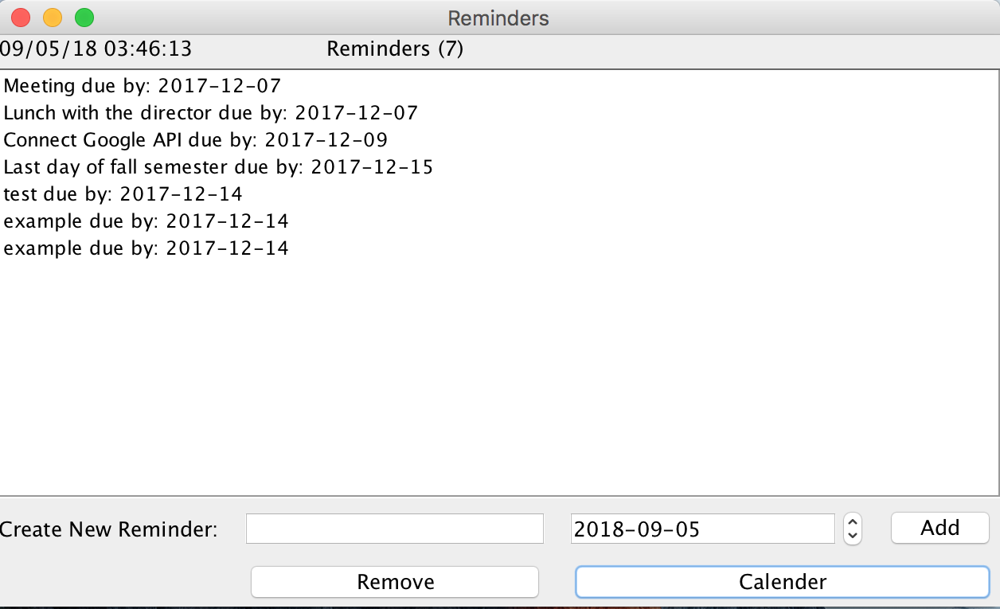

# ReminderGUI
A lightweight desktop app to keep track of events/reminders and add them to your Google calendar.

  
<!--   
 -->
<!--   -->

## Instructions
* Open in IDE
* Run Reminder.java 
* Sign into your Gmail account when prompted
